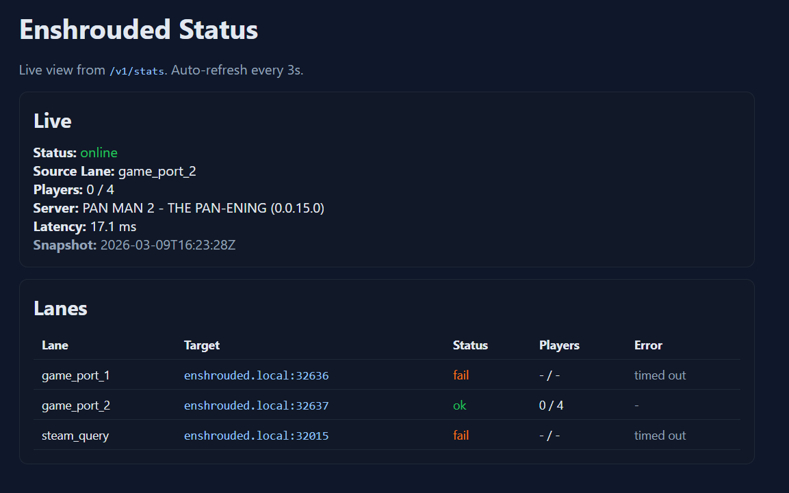

# How To Install An Enshrouded Self-Hosted Server

Open-source deployment bundle for running an Enshrouded self-hosted server or Enshrouded dedicated server on a spare PC, with Docker, or on Kubernetes.

This repo is aimed at operators who want a self-hosted Enshrouded server with multiple deployment options: bare Linux, Docker Compose, plain Kubernetes manifests, and a Helm chart.

This repo includes:
- a game-server image in [`image/`](/home/seslly/seslly-github/servertimeai/k8s/enshrouded_server/image)
- an optional lightweight stats API in [`tools/services/api/`](/home/seslly/seslly-github/servertimeai/k8s/enshrouded_server/tools/services/api)
- Docker Compose, plain Kubernetes manifests, and a Helm chart
- a bare-Linux installer for running the server as a user systemd service
- replayable probe/API tests in [`tools/tests/replay/`](/home/seslly/seslly-github/servertimeai/k8s/enshrouded_server/tools/tests/replay)

Use this repo if you want to:
- deploy an Enshrouded self-hosted server with Docker Compose
- run an Enshrouded dedicated server on Kubernetes with Helm or plain manifests
- host an Enshrouded server on a spare Linux machine without containers
- expose simple live metrics and Discord webhook notifications for an Enshrouded server

## Choose An Install Path

If you are here to install an Enshrouded server, start with one of these:

- [Install With Docker Compose](#install-with-docker-compose)
- [Install On Kubernetes With Plain Manifests Or Kustomize](#install-on-kubernetes-with-plain-manifests-or-kustomize)
- [Install On Kubernetes With Helm](#install-on-kubernetes-with-helm)
- [Install On Bare Linux With systemd](#install-on-bare-linux-with-systemd)

## Published Images And Helm Chart

- `ghcr.io/shipstuff/enshrouded-server`
- `ghcr.io/shipstuff/enshrouded-live-stats-api`

Published public Helm chart:
- `oci://ghcr.io/shipstuff/charts/enshrouded`

The Helm chart is validated on pull requests and `main`, and published to GHCR as an OCI chart on version tags like `v0.1.0`. The git tag must match [`Chart.yaml`](/home/seslly/seslly-github/servertimeai/k8s/enshrouded_server/helm/enshrouded/Chart.yaml#L1) `version`.

## Install With Docker Compose

Use the published images:

```bash
docker compose up -d
```

Build locally instead:

```bash
docker compose up -d --build
```

Override runtime defaults through shell env or a local `.env` file:

```bash
SERVER_NAME="My Enshrouded Server" \
SAVE_IMPORT_MODE=1 \
SAVE_IMPORT_BIND=127.0.0.1 \
docker compose up -d
```

Published-image overrides:

```bash
ENSHROUDED_IMAGE=ghcr.io/your-org/enshrouded-server:latest \
ENSHROUDED_STATS_API_IMAGE=ghcr.io/your-org/enshrouded-live-stats-api:latest \
docker compose up -d
```

Default exposed ports:
- UDP `15637`
- UDP `27015`
- TCP `8091` for the stats API
- TCP `8080` only matters when `SAVE_IMPORT_MODE=1`

## Install On Kubernetes With Plain Manifests Or Kustomize

Apply the included manifests:

```bash
kubectl apply -f namespace.yaml
kubectl apply -f pvc.yaml
kubectl apply -f statefulset.yaml
kubectl apply -f service.yaml
```

Or use the repo-root Kustomize wrapper:

```bash
kubectl apply -k .
```

The plain manifest defaults point at GHCR. If you publish under your own registry, update the image fields in [`statefulset.yaml`](/home/seslly/seslly-github/servertimeai/k8s/enshrouded_server/statefulset.yaml) or patch them after apply:

```bash
kubectl -n games set image statefulset/enshrouded \
  enshrouded=ghcr.io/your-org/enshrouded-server:latest \
  enshrouded-stats-api=ghcr.io/your-org/enshrouded-live-stats-api:latest
```

The included StatefulSet also binds the game/query UDP ports directly on the node with `hostPort`:
- `15637/udp`
- `27015/udp`

## Install On Kubernetes With Helm

Install with the public defaults:

```bash
helm upgrade --install enshrouded ./helm/enshrouded \
  --namespace games --create-namespace
```

Install the published OCI chart instead:

```bash
helm upgrade --install enshrouded oci://ghcr.io/shipstuff/charts/enshrouded \
  --version 0.1.0 \
  --namespace games --create-namespace
```

Typical overrides:

```bash
helm upgrade --install enshrouded ./helm/enshrouded \
  --namespace games --create-namespace \
  --set image.repository=ghcr.io/your-org/enshrouded-server \
  --set statsApi.image.repository=ghcr.io/your-org/enshrouded-live-stats-api \
  --set image.tag=v1.0.0 \
  --set statsApi.image.tag=v1.0.0
```

The chart also supports:
- `imagePullSecrets`
- disabling the sidecar API with `--set statsApi.enabled=false`
- enabling the save-import UI service with `--set service.saveImport.enabled=true`
- toggling direct node UDP bindings with `--set service.useHostPorts=true`

Helm now supports two server-config ownership modes:
- `serverConfig.mode=managed`: render `serverConfig.inlineJson` on every start and merge `userGroups` passwords from a Secret
- `serverConfig.mode=mutable`: require an existing JSON file on the PVC and leave it untouched

Managed mode is the default. The inline config is checked into values, while passwords come from a Secret JSON map keyed by group name. Inline `userGroups[].password` values are ignored at startup on purpose.

Example password secret:

```yaml
apiVersion: v1
kind: Secret
metadata:
  name: enshrouded-server-passwords
  namespace: games
stringData:
  user-group-passwords.json: |
    {"Default":"replace-me"}
```

Use it with Helm:

```bash
helm upgrade --install enshrouded ./helm/enshrouded \
  --namespace games --create-namespace \
  --set serverConfig.passwordSecret.name=enshrouded-server-passwords
```

If you want the UI or manual edits to own the config file instead, switch to mutable mode:

```bash
helm upgrade --install enshrouded ./helm/enshrouded \
  --namespace games --create-namespace \
  --set serverConfig.mode=mutable
```

To expose the startup save-import UI on a node port:

```bash
helm upgrade --install enshrouded ./helm/enshrouded \
  --namespace games --create-namespace \
  --set service.saveImport.enabled=true \
  --set service.saveImport.nodePort=32080 \
  --set saveImport.bind=0.0.0.0
```

## Install On Bare Linux With systemd

Install as your current user with rootless `systemd --user`:

```bash
./bare-linux/install.sh
```

Details and installer-only env vars are documented in [`bare-linux/README.md`](/home/seslly/seslly-github/servertimeai/k8s/enshrouded_server/bare-linux/README.md).

## Configure Server Runtime

The server config lives at `$ENSHROUDED_PATH/enshrouded_server.json`.
In `env` mode, if the file does not exist, the image copies [`image/enshrouded_server_example.json`](/home/seslly/seslly-github/servertimeai/k8s/enshrouded_server/image/enshrouded_server_example.json) and applies env overrides on each start.

Runtime config modes:
- `env` (default outside Helm): copy the example config if needed and apply selected env overrides on every start
- `managed`: render a full config template and merge password values from a secret-backed JSON map
- `mutable`: require an existing config file and do not rewrite it

Common env overrides:

| Env var | Default | Purpose |
|---|---|---|
| `SERVER_NAME` | `Enshrouded Server` | Server browser name |
| `PORT` | `15637` | Query/game config port |
| `SERVER_SLOTS` | `16` | Max players |
| `ENABLE_TEXT_CHAT` | `false` | Enable text chat |
| `SAVE_IMPORT_MODE` | `0` | Startup save-import UI gate |
| `SAVE_IMPORT_BIND` | `127.0.0.1` | Save-import bind address |
| `SAVE_IMPORT_PORT` | `8080` | Save-import HTTP port |
| `EXTERNAL_CONFIG` | `0` | Use your own JSON config without env patching |
| `ENSHROUDED_CONFIG_MODE` | auto | `env`, `managed`, or `mutable` |
| `AUTO_UPDATE_ON_BOOT` | `0` | Run Steam update/validate during startup |

When `EXTERNAL_CONFIG=1` or `ENSHROUDED_CONFIG_MODE=mutable`, you must provide your own `enshrouded_server.json` at `ENSHROUDED_CONFIG`.
When `ENSHROUDED_CONFIG_MODE=managed`, set `ENSHROUDED_MANAGED_CONFIG_TEMPLATE` to a full JSON template and optionally `ENSHROUDED_MANAGED_CONFIG_PASSWORDS` to a secret-backed JSON map like `{"Default":"replace-me"}`.

## Use The Optional Stats API And Landing Page

The optional API exposes:
- `/healthz`
- `/v1/stats`
- `/`

Default port: `8091`.

The API sidecar is enabled by default in Helm and the plain StatefulSet.
For local usage outside Kubernetes:

```bash
python3 ./tools/services/api/live_stats_api.py \
  --host 127.0.0.1 \
  --game-port 15637 \
  --steam-query-port 27015 \
  --bind 127.0.0.1 \
  --port 8091
```

More examples live in [`tools/USAGE.md`](/home/seslly/seslly-github/servertimeai/k8s/enshrouded_server/tools/USAGE.md).

Landing page screenshot:



The API always tries to read `enshrouded_server.json` so it can show effective server metadata such as name, IP, query port, slots, and configured user-group count without extra manual API config.

Debug mode is off by default. To expose the full redacted `startup_config` block in `/v1/stats` and in the landing page at `/`, start the API with `--debug` or `ENSHROUDED_API_DEBUG=1`.

When the API needs to read `enshrouded_server.json` for debug metadata, it resolves the path in this order:
- `ENSHROUDED_API_SERVER_CONFIG_PATH` if set
- `/home/steam/enshrouded/enshrouded_server.json`
- `$HOME/enshrouded/enshrouded_server.json`
- `$HOME/enshrouded-data/enshrouded/enshrouded_server.json`
- `./enshrouded_server.json` from the API process working directory

Probe host resolution order:
- `--host` or `ENSHROUDED_API_HOST` if set
- `server.ip` from `enshrouded_server.json` when it is a real address
- `127.0.0.1` when `server.ip` is `0.0.0.0`, empty, missing, or unreadable

Game port resolution order:
- `--game-port` or `ENSHROUDED_API_GAME_PORT` if set
- `server.queryPort` from `enshrouded_server.json` when it is a valid integer
- `15637` when `server.queryPort` is missing, invalid, or unreadable

`/v1/stats` response shape:

```json
{
  "ts": "2026-03-09T18:45:00Z",
  "host": "Enshrouded Server",
  "lane_ports": {
    "game_port": 15637,
    "steam_query": 27015
  },
  "live": {
    "status": "online",
    "source": "query",
    "source_lane": "game_port",
    "players_current": 3,
    "players_max": 16,
    "players_confidence": "high",
    "server_name": "Enshrouded Server",
    "server_version": "0.8.1.0",
    "latency_ms": 148.2,
    "a2s_player_count": 3,
    "a2s_rule_count": 12
  },
  "lanes": [
    {
      "lane": "game_port",
      "target": "127.0.0.1:15637",
      "ok": true,
      "status": "online",
      "players_current": 3,
      "players_max": 16,
      "player_count": 3,
      "rule_count": 12,
      "latency_ms": 148.2,
      "error": null
    }
  ],
  "local_stats": {
    "scope": "api_host",
    "cpu_percent": 35.0,
    "memory_percent": 42.0,
    "memory_used_mb": 860.1,
    "memory_total_mb": 2048.0,
    "loadavg_1m": 0.22,
    "loadavg_5m": 0.18,
    "loadavg_15m": 0.15,
    "error": null
  },
  "server_config": {
    "config_path": "/home/steam/enshrouded/enshrouded_server.json",
    "loaded": true,
    "name": "Enshrouded Server",
    "ip": "0.0.0.0",
    "query_port": 15637,
    "slot_count": 16,
    "user_group_count": 1,
    "error": null
  },
  "startup_config": {
    "server": {
      "config_path": "/home/steam/enshrouded/enshrouded_server.json",
      "loaded": true,
      "config": {},
      "error": null
    },
    "stats_api": {
      "bind": "0.0.0.0",
      "port": 8091,
      "host": "127.0.0.1",
      "debug": true,
      "timeout": 1.0,
      "retries": 2,
      "cache_ttl": 3.0,
      "lane_ports": {
        "game_port": 15637,
        "steam_query": 27015
      },
      "expose_local_stats": false,
      "log_events": false,
      "webhook": {
        "url": null,
        "discord_url": null,
        "timeout": 3.0,
        "events": [
          "down",
          "high_cpu",
          "high_latency",
          "high_memory",
          "player_add",
          "player_remove",
          "up"
        ],
        "high_latency_ms": null,
        "high_memory_percent": null,
        "high_cpu_percent": null
      }
    }
  }
}
```

Notes:
- `local_stats` is omitted unless `--expose-local-stats` or `ENSHROUDED_API_EXPOSE_LOCAL_STATS=1` is enabled.
- `server_config` is included whenever the API can resolve a config path, even when the file is missing or unreadable; in that case `loaded` is `false` and `error` is populated.
- `startup_config` is omitted unless `--debug` or `ENSHROUDED_API_DEBUG=1` is enabled.
- During warmup or probe errors, the API may also include a top-level `error` field and return placeholder values in `live`.

## Use The Optional Save Import UI

The temporary upload/download UI is disabled by default.
Enable it for a single boot by setting `SAVE_IMPORT_MODE=1`.

Safer default:
- `SAVE_IMPORT_BIND=127.0.0.1`

Only switch `SAVE_IMPORT_BIND` to `0.0.0.0` if you intentionally want to expose the UI over the network.

## Validate Local Changes

Replay checks:

```bash
bash ./tools/tests/replay/test_query_probe.sh
bash ./tools/tests/replay/test_lane_probe_snapshot.sh
bash ./tools/tests/replay/test_live_stats_api.sh
python3 ./tools/tests/replay/test_query_steam_a2s.py ./tools
```

Optional Helm render check:

```bash
helm template enshrouded ./helm/enshrouded >/dev/null
```

Optional Kustomize render check:

```bash
kubectl kustomize . >/dev/null
```
